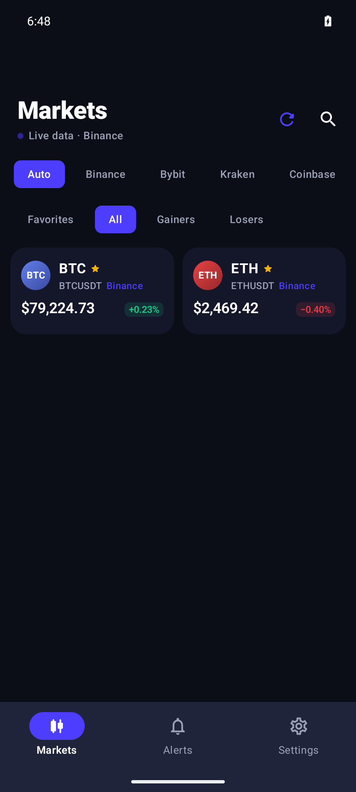
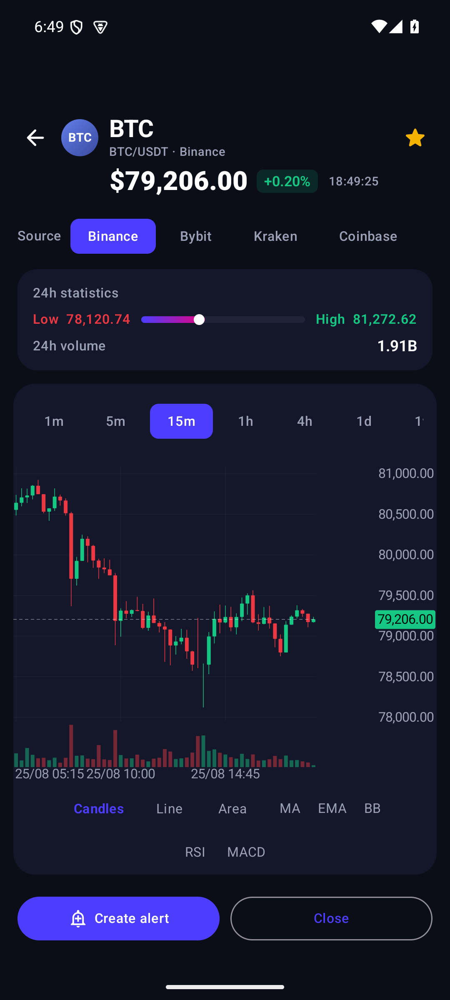
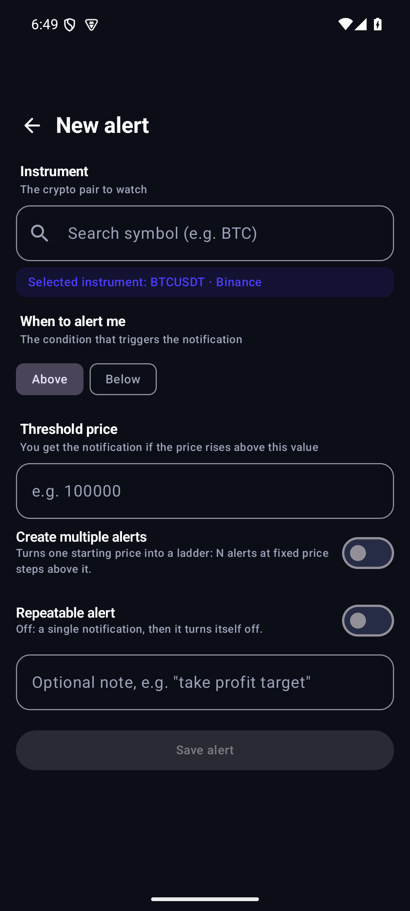
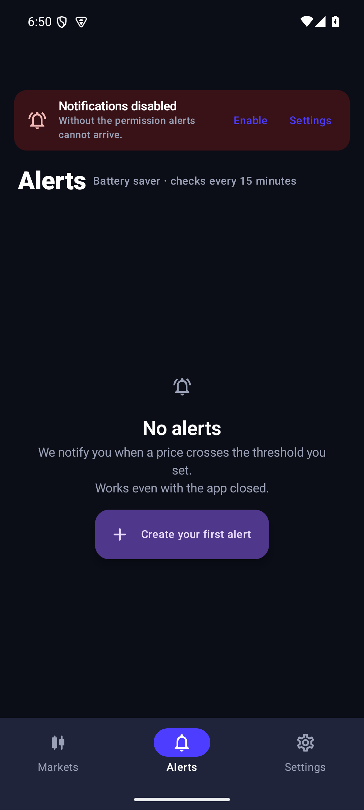

<div align="center">

# XON Trader

**The open-source crypto terminal for Android.**

Live prices, candlestick charts and price alerts from **7 exchanges in one app** —
no account, no API key, no backend, no tracking.

[](LICENSE)
[](#install)
[](#exchanges)
[](#why-xon-trader)





**Download the APK** from the [latest release](https://github.com/adgscotti-png/xon-trader/releases/latest), install it, and you're done. Everything runs on your phone — the app talks to the exchanges directly, and nothing is sent anywhere else.

</div>

---

## Why XON Trader

The crypto market has no shortage of trackers, but almost all of them push you
toward the same trade: an account, a phone number, an API key, ads, or a
subscription. Most route your market data through their own backend so they can
track you.

**XON Trader takes the opposite direction.**

- **No account.** Open the app and the whole market is there. There is nothing
  to sign up for, because there is nothing to sync.
- **No API key.** All seven providers expose their public market data, and the
  app reads it directly from their public endpoints. Keys and accounts are only
  needed to *trade* — this app only *watches*.
- **No backend.** There is no XON Trader server. Your phone connects straight
  to each exchange, so there is no third party between you and the data.
- **No telemetry, no ads, no analytics SDKs.** The app does not collect,
  report or sell anything. Your watchlist, favorites and alerts live in a local
  database on your device — that's it.
- **Battery-first.** In *Save* mode the live connections close when the app
  goes to the background and reopen when you come back. Realtime mode (for
  price alerts) is opt-in, and keeps a single foreground service alive instead
  of burning your battery in the background.

XON Trader is **free and open source (GPL-3.0)**. Read the code, build it
yourself, audit it, fork it. It is an informational tool for watching markets —
not financial advice.

---

## Features

- **7 market providers in one app** — Binance, Bybit, Kraken, Coinbase
  Exchange, OKX, Bitfinex and KuCoin. Switch the ranking source with a chip row
  or pick *Auto* for the best available with automatic failover.
- **A source per coin** — every coin can be fed by the exchange you choose,
  from the coin screen. Your watchlist then shows that exchange's price, badge
  and chart, even when the same coin exists on five other exchanges.
- **Live watchlist** — up to 20 pairs, realtime, each from a different
  exchange if you like. Add the same coin from two exchanges to see a true
  multi-source view.
- **Interactive charts** — candlestick, line and area; 13 timeframes from 1m
  to 1M; MA/EMA/Bollinger overlays; RSI and MACD sub-charts; pinch-zoom and an
  OHLC crosshair.
- **Price alerts that work even when the app is closed** — above/below price,
  or ±% in 24h; single or repeatable; notifications with quick actions and a
  deep link straight to the chart. Optional *Realtime* mode keeps them live via
  a foreground service, and it survives a reboot on Android 15+.
- **Batch alert ladders** — turn one starting price into a ladder of 2–20
  alerts at a fixed step (e.g. 20 alerts every $1,000 from $90,000), each one
  independent and editable.
- **Alert levels on the chart** — active alert thresholds are drawn as thin
  lines on the candles, labeled in the gutter.
- **Home-screen widgets** — a 2×1 price widget and a 4×2 watchlist widget
  (Glance), refreshed every 15 minutes and on every app open. Tapping a widget
  opens the exact coin's chart.
- **Gainers & Losers** — the best and worst movers across the market, from any
  provider, always landing at the real top of the ranking.
- **Offline-first** — market data is cached locally in Room, so the app opens
  fast and works with a weak connection.
- **Privacy controls** — optional biometric/PIN app lock, and JSON
  backup/restore of your favorites and alerts.

<p align="center">
  
</p>

---

## Exchanges

| Provider | Data |
|---|---|
| **Binance** | prices, rankings, candles, live feed |
| **Bybit** | prices, rankings, candles, live feed |
| **Kraken** | prices, rankings, candles, live feed |
| **Coinbase Exchange** | prices, rankings, candles, live feed |
| **OKX** | prices, rankings, candles, live feed |
| **Bitfinex** | prices, rankings, candles, live feed |
| **KuCoin** | prices, rankings, candles, live feed |

All seven are **public and keyless** — no registration needed for any of them.
*Auto* picks the best available source per coin and fails over automatically if
one exchange is slow or unreachable.

---

## Install

XON Trader requires **Android 8.0+** (API 26).

1. Grab the latest APK from the
   [releases page](https://github.com/adgscotti-png/xon-trader/releases/latest)
   (the file is named `xon-trader-<version>.apk`).
2. Open the downloaded file on your phone.
3. When Android asks, allow installs from your browser or file manager
   (Settings → *Install unknown apps*), and confirm.

That's it — no Play Store account, no login, no permissions beyond what the app
asks for at runtime.

---

## Build from source

The build is fully reproducible from a pinned Docker image — the only
dependency on your machine is **Docker**.

```bash
./docker/build.sh                 # debug build → app/build/outputs/apk/debug/
./docker/build.sh assembleRelease # signed R8 release → app/build/outputs/apk/release/
```

The first run pulls the builder image and installs the Android SDK (~1 GB) into
a persistent volume; afterwards everything is warm.

Release signing reads `keystore/release.properties` (excluded from git).
**Back up the `keystore/` folder** — without it, future signed updates under
the same key are impossible.

- Builder image: `docker/builder.Dockerfile` (Temurin 21 + Gradle 8.9)
- SDK: volume `/opt/android-sdk`, installed by `docker/sdk-setup.sh`
- Stack: **Kotlin 2.1 · AGP 8.7.3 · Compose Material 3 · Room · Retrofit ·
  kotlinx.serialization**
- Data flows through a clean **Port/Adapter** architecture
  (`MarketDataProvider` port + one adapter per exchange), with a canonical
  symbol model mapped to each provider's native format at the adapter boundary,
  per-provider rate limiters and circuit breakers.

---

## Releases

Releases and the full changelog live in the
[Releases page](https://github.com/adgscotti-png/xon-trader/releases) and in
[`CHANGELOG.md`](CHANGELOG.md). Highlights:

- **0.3.2** — compact market cards with the exchange name inline, *Auto* mode
  now refreshes every provider, charts fixed on Bybit/Coinbase, Kraken grid
  fixed.
- **0.3.0** — batch alert ladders, alert levels on the chart, realtime feed
  survives reboot on Android 15.
- **0.2.9** — the 7-provider era: per-coin source picker, per-provider markets
  tab, Auto failover.
- **0.2.0-beta1** — the first complete beta: live markets, interactive charts,
  alerts, widgets.

---

## License

GPL-3.0-only — see [`LICENSE`](LICENSE).

Copyright © 2026 XON Trader contributors.
